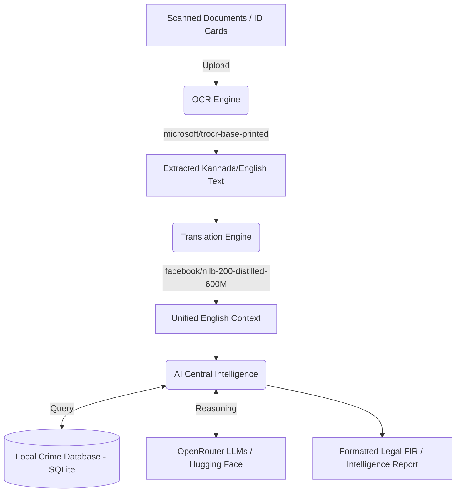

# 🛡️ KAAVAL AI: Advanced Public Safety & Emergency Intelligence Platform

> **KAAVAL** (meaning "Guard" or "Protection" in Kannada) is a next-generation AI-powered intelligence and public safety platform. Designed for law enforcement officers and emergency personnel, KAAVAL accelerates incident response by providing real-time document scanning (OCR), context translation, verified crime record querying, and automated First Information Report (FIR) drafting.

---

## 📑 Table of Contents
1. [Overview](#-overview)
2. [Core Capabilities](#-core-capabilities)
3. [Technology Stack](#-technology-stack)
4. [Architecture & AI Pipeline](#-architecture--ai-pipeline)
5. [Project Structure](#-project-structure)
6. [Local Development Setup](#-local-development-setup)
7. [Environment Variables](#-environment-variables)
8. [API Reference & Testing](#-api-reference--testing)
9. [Troubleshooting & Fallbacks](#-troubleshooting--fallbacks)

---

## 🌟 Overview
KAAVAL merges state-of-the-art Generative AI with intuitive interface design (inspired by the **Outcrowd design system**) to create a seamless operational dashboard for law enforcement. Whether an officer is scanning a handwritten FIR from a remote station or querying the central database for a suspect's history, KAAVAL provides a unified, glassmorphic spatial UI that is highly responsive.

---

## 🚀 Core Capabilities

- **📄 Document OCR Scanner:** Extracts printed and handwritten text from scanned incident logs, IDs, and police complaint reports utilizing the **Hugging Face TrOCR** (`microsoft/trocr-base-printed`) model.
- **🌐 Language Translation Hub:** Real-time, bidirectional translation of parsed text and context between **Kannada (ಕನ್ನಡ)** and **English** using the **NLLB-200** (`facebook/nllb-200-distilled-600M`) model.
- **🧠 Central AI Assistant (RAG):** A Retrieval-Augmented Generation (RAG) powered intelligence assistant. Uses **NVIDIA Nemotron** or **Google Gemma** models via OpenRouter to retrieve criminal records, cross-reference vehicles, and execute intelligence sweeps against the local SQLite crime database.
- **⚖️ Legal FIR Drafting Engine:** Automatically structures and drafts formal legal First Information Reports (FIRs) based on officer notes, maintaining strict legal vernacular.
- **💻 Interactive Spatial UI:** A modern frontend featuring Apple/Linear-inspired aesthetics, glassmorphic panels, dynamic animations, and a central navigation **OmniDock**.

---

## 💻 Technology Stack

### Frontend
- **Framework:** Next.js (App Router)
- **Styling:** Tailwind CSS, PostCSS
- **Components:** Radix UI / shadcn-ui (Customized for Outcrowd aesthetics)
- **Language:** TypeScript

### Backend
- **Server:** Python 3 (Custom HTTP Server / REST API)
- **Database:** SQLite (`kaaval.db` - 1.7GB+)
- **AI / ML Integration:** Hugging Face Hub (Transformers), OpenRouter API
- **Data Ingestion:** Custom Python scripts (`ingest_datasets.py`)

---

## 🧠 Architecture & AI Pipeline

The pipeline is designed to be highly modular, ensuring different engine components can be upgraded independently.



### Resilient Processing Fail-safe
To ensure the application remains functional in offline, low-bandwidth, or dev environments without API keys, KAAVAL includes a **graceful simulation fallback mode**. If `HF_TOKEN` or `OPENROUTER_API_KEY` are missing, the platform automatically switches to local simulation, mocking high-fidelity reports and database sweeps without throwing blocking errors.

---

## 📁 Project Structure

```text
KAAVAL/
├── backend/                  # Core Python AI Server & Data Layer
│   ├── data/                 # Datasets and raw files
│   ├── engines/              # Modular search and processing engines
│   ├── ml_engine/            # ML models (OCR, Translation, LLM hooks)
│   ├── kaaval.db             # Primary SQLite Crime Database (1.7GB+)
│   ├── main.py               # Core server routing and API endpoints
│   ├── router.py             # Advanced query routing logic
│   ├── database.py           # Database connection and CRUD operations
│   ├── ingest_datasets.py    # Scripts to populate SQLite from raw data
│   └── requirements.txt      # Python dependencies
├── src/                      # Next.js Frontend Application
│   ├── app/                  # App Router Pages
│   │   ├── (dashboard)/      # Protected dashboard routes
│   │   │   ├── ocr-translation/ # OCR & Translation Interface
│   │   │   └── assistant/    # Central AI Assistant Chatbot
│   ├── components/           # Reusable UI components (e.g., OmniDock)
│   └── lib/                  # Utility functions and types
├── public/                   # Static assets (images, templates, icons)
├── package.json              # Node.js dependencies
└── README.md                 # Project Documentation
```

---

## ⚙️ Environment Variables

Create a `.env` file in the `backend/` directory to enable live API processing:

```env
# Hugging Face API key for OCR (TrOCR) and Translation (NLLB-200)
# Get this from: https://huggingface.co/settings/tokens
HF_TOKEN="hf_your_token_here"

# OpenRouter API key for Central Intelligence (NVIDIA Nemotron / Gemma)
# Get this from: https://openrouter.ai/keys
OPENROUTER_API_KEY="sk-or-your_token_here"

# Defines the default reasoning model for the AI Assistant
REASONING_MODEL="google/gemma-4-31b-it:free"
```

---

## 🏁 Local Development Setup

### Prerequisites
*   [Node.js (v18+ LTS)](https://nodejs.org)
*   [Python 3.10+](https://www.python.org/downloads/) (Ensure Python is added to `PATH` during installation)
*   Git

### Step 1: Initialize the Python Backend
1. Open a terminal and navigate to the backend directory:
   ```bash
   cd KAAVAL/backend
   ```
2. *(Optional but recommended)* Create and activate a virtual environment:
   ```bash
   python -m venv venv
   # Windows
   .\venv\Scripts\activate
   # Mac/Linux
   source venv/bin/activate
   ```
3. Install Python dependencies:
   ```bash
   pip install -r requirements.txt
   ```
4. Start the backend server:
   ```bash
   python main.py
   ```
   *The backend will initialize the SQLite connection and start listening on `http://0.0.0.0:8000`.*

### Step 2: Initialize the Next.js Frontend
1. Open a **new terminal window** and navigate to the project root:
   ```bash
   cd KAAVAL
   ```
2. Install Node packages:
   ```bash
   npm install
   ```
3. Start the Next.js development server:
   ```bash
   npm run dev
   ```
4. Access the application in your browser at: **`http://localhost:3000`**

---

## 🧪 API Reference & Testing

You can test the end-to-end pipeline using the Next.js UI:

1. **Access the Dashboard:** Navigate to `http://localhost:3000/ocr-translation`.
2. **Load Sample:** Click **"Load Sample Incident Report"** to populate a test document template.
3. **Run OCR:** Click **"Run OCR Text Extraction"**. If `HF_TOKEN` is set, it will run live inference; otherwise, it will return a high-fidelity simulation.
4. **Translate:** Click **"Translate Text Context"** to see the OCR results converted to Kannada.
5. **Intelligence Handoff:** Click **"Import OCR to Assistant"** to seamlessly transfer the extracted text to the Central AI Assistant for further querying, cross-referencing, or FIR generation.

---

## 🔧 Troubleshooting & Fallbacks

- **Model Loading Errors:** If Hugging Face models fail to load, ensure your `HF_TOKEN` has read permissions and is correctly placed in `backend/.env` without leading/trailing spaces.
- **Port Conflicts:** If port `8000` or `3000` is in use, you can change the backend port in `main.py` and the frontend port by running `npm run dev -- -p 3001`.
- **Simulation Mode Active:** If you see "(Simulation Mode)" appended to your API responses, the backend has gracefully fallen back because an API key was not found or a rate limit was reached. Check your `.env` variables.

---
*Built for KAAVAL AI.*
