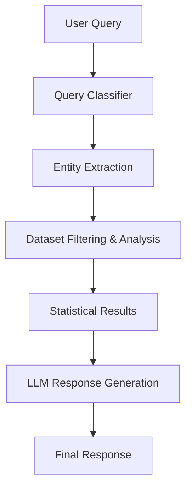

# 🛡️ KAAVAL AI: Next-Generation Public Safety & Emergency Intelligence Platform

<div align="center">
  
  
  
  
  
</div>

> **KAAVAL** (meaning "Guard" or "Protection" in Kannada) is an advanced, ultra-responsive AI intelligence dashboard designed for law enforcement and emergency response. It merges cutting-edge Machine Learning (OCR, Neural Translation, RAG-based LLM orchestration) with a breathtaking **Apple iOS / One UI Hybrid** glassmorphic spatial interface.

---

## 🌟 The Vision & What's New

We built KAAVAL to solve the critical latency and data silos in traditional police command centers. The platform allows officers to scan handwritten FIRs, translate evidence in real-time, cross-reference suspects against a 1.7GB crime database, and dispatch emergency units instantly.

**Recent Upgrades for this Hackathon:**
- **Dynamic Light/Dark Mode:** Completely rebuilt styling utilizing CSS variables for instant, jank-free theme switching. Features an Apple-inspired off-white mode and a true OLED dark mode.
- **Widespread Interactivity:** Replaced static elements with a global `sonner` Toast notification engine. Buttons, filters, and emergency triggers now slide in beautiful visual confirmations.
- **Interactive SOS Dispatch:** A live top-navigation SOS trigger that mimics a critical dispatch protocol and routes users straight to the Command Center interface.

---

## 🧠 Machine Learning Engine (Technical Architecture)

KAAVAL isn’t just a dashboard—it is powered by a robust, multi-modal Machine Learning pipeline orchestrated via **Python 3** and **LangChain**.

### 1. Vision & Document Parsing (OCR)
* **Model:** `microsoft/trocr-base-printed`
* **Function:** In the real world, police documents and FIRs are noisy, degraded, or handwritten. We utilize Hugging Face's Transformer-based Optical Character Recognition (TrOCR) to extract text with incredibly high accuracy, bypassing the limitations of legacy OCR engines like Tesseract.

### 2. Bilingual Neural Translation Context
* **Model:** `facebook/nllb-200-distilled-600M`
* **Function:** Evidence and witness statements in Karnataka are primarily in Kannada. Our translation node uses the NLLB (No Language Left Behind) model to provide real-time, bidirectional translation to English, ensuring the central LLM can reason over the context perfectly without losing crucial nuances.

### 3. Agentic RAG & LangChain Orchestration
* **Architecture:** `langchain`, `langchain-openai`, custom `query_classifier.py`
* **Function:** We built a custom reasoning engine that acts as the "brain" of the AI Assistant. It enables KAAVAL AI to answer crime-related queries by analyzing the Karnataka crime dataset. 

**Core ML Features:**
- **Natural Language Query Handling:** Accepts crime-related questions in plain English.
- **Query Classification:** Identifies whether a query should be handled by the ML engine, District Analytics, SQLite Legal Search, or Web Search.
- **Entity Extraction:** Detects crime types and district names from user queries using regex-based matching.
- **Crime Data Analysis:** Performs filtering, aggregation, and comparison on the crime dataset using Pandas.
- **District-wise Statistics:** Retrieves crime counts and district-level insights from the dataset.
- **LLM-Based Response Generation:** Converts analytical results into human-readable responses using OpenRouter or Groq models.

**Processing Pipeline:**

```mermaid
graph TD
    A[User Query] --> B[Query Classifier]
    B --> C[Entity Extraction]
    C --> D[Dataset Filtering & Analysis]
    D --> E[Statistical Results]
    E --> F[LLM Response Generation]
    F --> G[Final Response]
```

### 4. Dynamic Data Visualization
* **Stack:** `pandas`, `plotly`
* **Function:** If the AI Assistant detects a need for visualization (e.g., "plot the theft cases"), it automatically parses the SQLite data into a `pandas` DataFrame and generates interactive `plotly` HTML charts on the fly, rendering them directly in the chat interface.

### 5. Resilient Simulation Fallback (Hackathon Fail-safe)
* **Function:** Live demos are prone to API rate limits (HTTP 429) and network drops. We engineered a seamless **Simulation Mode**. If `HF_TOKEN` or `OPENROUTER_API_KEY` fail, the backend instantly routes to offline Mock Generators. The UI remains fully operational, providing simulated high-fidelity intelligence reports and database sweeps without throwing blocking errors.

---

## 🚀 Step-by-Step Execution Guide

To run KAAVAL locally for evaluation, you need to spin up both the Next.js Frontend and the Python Backend.

### 1. Start the Python Backend (ML Engine)
Open a terminal and navigate to the project root:
```bash
cd backend
python -m venv venv
# Windows: venv\Scripts\activate | Mac/Linux: source venv/bin/activate
pip install -r requirements.txt
```
*(Optional)* Add your `.env` file inside `backend/` with `OPENROUTER_API_KEY` and `HF_TOKEN`. If you skip this, KAAVAL will intelligently run in its robust Offline Simulation Mode.
```bash
python main.py
```
> The backend will spin up on `http://localhost:8000`.

### 2. Start the Next.js Frontend (Spatial UI)
Open a *new* terminal and navigate to the project root:
```bash
npm install
npm run dev
```
> The frontend will be available at `http://localhost:3000`.

---

## 🎯 How to Use the Platform (For Judges)

We have designed KAAVAL to be highly interactive. When you launch the frontend:

1. **Test the Aesthetic:** On the landing page, click the **Sun/Moon icon** in the top navigation. Watch the entire application smoothly transition between Apple Light Mode and OLED Dark Mode.
2. **Trigger an Emergency:** Click the red **SOS** button in the top navigation bar. You will see a critical dispatch notification slide in, and you will be routed to the live SOS Dispatch interface.
3. **Explore the Command Center:** Navigate to the Dashboard. Click on the time filters (`24 Hours`, `7 Days`) and the crime category filters (`Property`, `Cyber`). Notice how every action is acknowledged with a crisp `sonner` toast notification.
4. **Interact with the AI Assistant:** 
   - Click **AI Assistant** in the sidebar.
   - Type a query like: *"Cross-reference suspect vehicle KA-03-HA-8812"* or *"Draft a formal FIR for a mobile theft at Majestic Bus Stand."*
   - Watch the neural interface process the query, showing glassmorphic loading states, and returning highly structured, actionable law enforcement intelligence.

---

## 📁 Project Structure

```text
KAAVAL/
├── backend/                  # Core Python AI Server & Data Layer
│   ├── engines/              # Modular search (legal matching, ANPR)
│   ├── ml_engine/            # LangChain orchestration, OCR, Translation
│   ├── database.py           # SQLite handlers
│   └── main.py               # REST API Entry Point
├── src/
│   ├── app/                  # Next.js 15 App Router (Dashboard Pages)
│   ├── components/           # UI Components (Glass panels, OmniDock, Toasts)
│   └── lib/                  # Utilities (Palette variables)
├── public/                   # Static assets
└── globals.css               # CSS Variables for Light/Dark Mode
```

---
*Built for the future of public safety.*